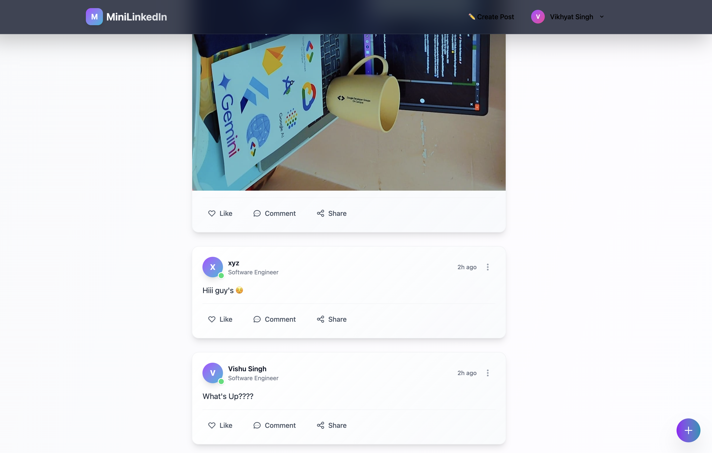
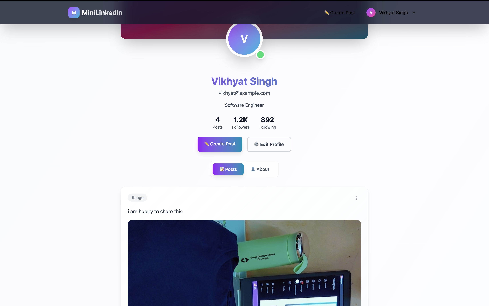
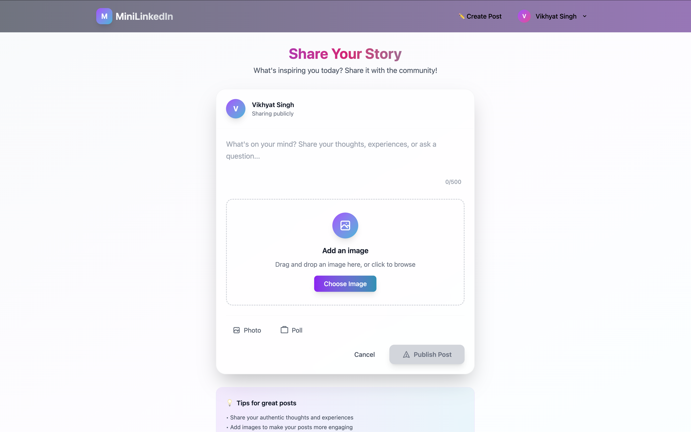

# 💼 Mini_LinkedIn

A full-stack LinkedIn-style social media platform where users can register, create posts, view others' content, and interact with a professional network UI.

---

## 🚀 Live Demo

- **Frontend + Backend** (Render): [https://mini-linkedin-anjp.onrender.com](https://mini-linkedin-anjp.onrender.com)  
  ⚠️ Please wait 2–3 minutes for the Render server to wake up.

---

## 📦 Tech Stack

- **Frontend**: React (Vite) + TailwindCSS
- **Backend**: Node.js + Express
- **Database**: MongoDB (via Mongoose)
- **Cloud Storage**: Cloudinary (for image uploads)
- **Auth**: JWT + Cookies
- **Hosting**: Render (Frontend + Backend)

---

## 🛠️ Installation & Running Locally

### 1. Clone the repository

```bash
git clone https://github.com/your-username/mini-linkedin.git
cd mini-linkedin
```

### 2. Install Backend

```bash
cd backend
npm install
npm run dev
```

Backend will run on `http://localhost:5001`

Create a `.env` file in `backend/` and add:

```
PORT=5001
MONGO_URI=your_mongodb_connection_string
JWT_SECRET=your_jwt_secret
CLOUDINARY_CLOUD_NAME=your_cloud_name
CLOUDINARY_API_KEY=your_api_key
CLOUDINARY_API_SECRET=your_api_secret
```

### 3. Install Frontend

Open a new terminal:

```bash
cd frontend
npm install
```

Then start the dev server:

```bash
npm run dev
```

Frontend will be available at `http://localhost:5173`

---

## ✨ Features

- 🔐 JWT-based authentication with cookies
- 📸 Cloudinary image upload support
- 📝 Create and view posts
- 🧾 Responsive UI styled with Tailwind
- 🌐 CORS-configured for frontend/backend communication

---

## 📸 Screenshots

> Add screenshots from your project UI in the `screenshots/` folder and link them here.

| Home Feed | Profile Page | Create Post |
|----------|--------------|-------------|
|  |  |  |

---

## 🌟 Extra Features

The following features were implemented **in addition** to the assignment requirements:

- **Image Upload in Posts**: Users can upload images with their posts (via Cloudinary)
- **Profile Page with Bio**: Users can see their bio in the profile and any other users profile
- **404 Not Found Page**: A fallback page for unmatched routes
- **Protected Routes**: Frontend routes like `/create-post` and `/profile` are accessible only to authenticated users
- **Persistent Login**: Auth token is stored in cookies for session persistence
- **User Posts Filtering**: Only the selected user's posts are shown on their profile
- **Responsive Design**: Fully responsive UI across desktop and mobile

---

## 📐 Folder Structure

```
mini-linkedin/
│
├── backend/
│   ├── src/
│   │   ├── routes/
│   │   │   ├── auth.route.js
│   │   │   └── post.route.js
│   │   ├── controllers/
│   │   │   ├── auth.controller.js
│   │   │   └── post.controller.js
│   │   ├── middleware/
│   │   │   └── auth.middleware.js
│   │   ├── utils/
│   │   │   ├── db.js
│   │   │   └── cloudinary.js
│   │   └── models/
│   │       ├── User.js
│   │       └── Post.js
│   └── server.js
│
├── frontend/
│   ├── src/
│   │   ├── components/
│   │   │   ├── Navbar.jsx
│   │   ├── lib/
│   │   │   ├── axios.js
│   │   ├── pages/
│   │   │   ├── Home.jsx
│   │   │   ├── Login.jsx
│   │   │   ├── Register.jsx
│   │   │   ├── Profile.jsx
│   │   │   ├── CreatePost.jsx
│   │   │   └── NotFound.jsx
│   │   ├── App.jsx
│   │   └── main.jsx
│   └── index.html
│
├── .env
├── .gitignore
├── README.md
└── package.json
```

---

## 📬 Feedback & Contributions

Feel free to open issues or submit pull requests. Feedback, suggestions, and improvements are welcome!

---

## 🔗 Useful Links

- [Cloudinary](https://cloudinary.com/)
- [MongoDB](https://www.mongodb.com/)
- [Render](https://render.com/)
- [Netlify](https://netlify.com/)
